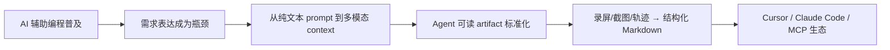

# 多模态需求采集与推断工具 · 市场调研报告

> 文档状态：v1.0  
> 调研日期：2026-06-10  
> 对应产品 PRD：`docs/需求文档.md`（草稿 v0.10）  
> 调研方法：PRD 需求拆解 + 公开资料检索 + 竞品官网/GitHub 交叉验证

---

## 1. 执行摘要

### 1.1 产品定位（待调研对象）

本产品（下文简称 **Rake**）是一款 **Electron 桌面端**工具：用户边录屏边语音讲解需求，工具同步密集记录鼠标（约 20 Hz）、键盘、标注与语音，经时间轴对齐后由大模型推断真实需求，**最终输出可直接交给 Claude Code / Cursor / Codex / Trae 等编程智能体的结构化开发 prompt**。

核心差异化组合：

| 维度 | Rake 设计 |
|------|-----------|
| 输入形态 | 录屏 + 语音 + 高密度鼠标/键盘 + 可选实时标注 |
| 对齐精度 | 单调时钟 + 场记板信标 + 指代词×鼠标静止点交叉验证 |
| 输出形态 | 面向编程智能体的 prompt / Markdown 需求文档（含关键时刻合成截图） |
| 代码上下文 | 可关联多 Git 仓库，已有项目支持多轮推断 |
| 数据与模型 | 原始数据本地存储；大模型用户自配 API Key |
| 商业化 | 账户/订阅服务端；采集数据默认不上云 |

### 1.2 调研结论（一句话）

**市场上存在大量「相近但不相同」的产品**——尤其是 2025–2026 年兴起的「录屏/截图 → AI 结构化文档 → 喂给编程智能体」赛道已有明确玩家（markupR、Replay、Spectr、BugReel 等），但 **尚未发现与 Rake PRD 完整重合的单一竞品**。最接近的是 **markupR** 与 **Replay**；Rake 若在 **鼠标/键盘全过程采集、语义-空间精对齐、已有项目多仓库推断、实时标注 + 导出规范** 上落地，仍具备清晰差异化空间。

### 1.3 市场机会判断

| 判断项 | 结论 |
|--------|------|
| 需求是否真实存在 | **是**。AI 辅助编程普及后，「如何把意图准确传给 Agent」已成为显性问题；Ben's Bites、Cobalt Capture 等均在强调「视频/视觉反馈 vs Agent 可读 artifact」的张力 |
| 竞争是否激烈 | **中等偏热**。Bug 反馈 / Agent 反馈细分已拥挤；「需求采集 → 开发 prompt」细分仍较新 |
| 进入窗口 | **仍开放**。多数竞品聚焦 bug 报告或单次反馈，而非「全新项目需求梳理 + 多仓库改造 + 多轮 Session」 |
| 主要风险 | markupR 等开源工具迭代快；Claude Code/Cursor 原生 Skills 降低独立工具必要性；用户可能直接用 Loom + Skill 凑合 |

---

## 2. 调研范围与方法

### 2.1 检索维度

按 PRD 能力拆分为以下检索轴：

1. **多模态采集**：录屏 + 语音 + 鼠标/键盘轨迹
2. **AI 推断**：从录制生成 PRD / 需求 / 开发 prompt
3. **编程智能体对接**：Cursor、Claude Code、MCP、Markdown 导出
4. **代码仓库上下文**：关联 GitHub / 本地仓库
5. **部署形态**：桌面端 vs 浏览器 vs CLI/Skill
6. **数据隐私**：本地优先 vs 云端处理

### 2.2 信息来源

- 竞品官网、GitHub README、AWS Marketplace 等公开资料
- 开发者社区（DEV.to、Ben's Bites 相关讨论）
- 中文生态：Prompt 需求文档（PRD）方法论讨论；暂未发现与 Rake 同构的成熟中文产品

### 2.3 未纳入范围

- 纯项目管理/工单系统（Jira、Linear 等）——仅在其集成能力层面提及
- 纯代码生成 IDE（Cursor、Windsurf 本体）——作为 **输出目标** 而非直接竞品
- 企业级 ALM / 需求管理套件（IBM DOORS、Jama 等）——用户群与场景差异大

---

## 3. 市场背景与趋势

### 3.1 宏观趋势



**关键趋势：**

1. **「Agent 吃不了视频」推动 artifact 化**  
   Cobalt Capture 等明确主张：Loom 类视频无法被 coding agent 直接消费，需转为带截图 URL 的 Markdown。Rake 的导出策略（Markdown + 相对路径截图）与此趋势一致，但 Rake 额外保留原始多模态数据用于高精度对齐。

2. **MCP / Skills 成为集成主通道**  
   markupR、screenpipe、NarrateAI DemoMaker 等均提供 MCP 或 Agent Skill，使用户在 IDE 内即可完成采集→推断。Rake 若仅做独立桌面 App，需考虑 MCP/CLI 出口以免被边缘化。

3. **本地优先与 BYOK**  
   录屏含敏感信息，screenpipe、markupR、Replay 均强调本地处理与用户自带 API Key。与 Rake PRD 的隐私策略高度一致，已是该细分市场的 **准入门槛** 而非差异化。

4. **从 Bug 报告向「需求 / Spec」延伸**  
   Spectr、PRDKit、4ge 等将输出从「复现步骤」扩展到「产品 Spec / 功能计划 / PRD」。Rake 定位更靠近这一延伸方向。

5. **中文市场**  
   中文检索未发现与 Rake 同构的桌面产品；存在「AI 时代如何写 PRD / Prompt 需求文档」的方法论讨论（如 srs.pub），说明 **需求文档形态正在演变**，但工具侧仍以国际产品为主。

### 3.2 目标用户与付费意愿（推断）

| 用户群 | 痛点 | 现有替代方案 | 付费意愿 |
|--------|------|--------------|----------|
| 独立开发者 / 小团队 | 向 Cursor 描述改 UI 太费劲 | Loom + 手工写 prompt；markupR | 中（习惯免费开源） |
| 产品负责人 + 工程团队 | 需求评审到开发 handoff 损耗大 | PRDKit、4ge、Notion AI | 中高 |
| 接外包/ agency | 客户口述需求难结构化 | 录屏 + 人工整理 | 高（可省 BA 时间） |

Rake 商业化（订阅 + 用量）在 markupR 开源免费、BugReel 社区版免费的背景下，需明确 **Pro 价值点**（如多仓库推断、团队席位、对齐精度、模板库），否则获客成本高。

---

## 4. 竞品 landscape 分类

### 4.1 分类总览

```
                    输出给编程 Agent
                          ↑
    Cobalt Capture ───────┼─────── markupR / Replay
    (截图+语音)            │         (录屏+语音+上下文)
                          │
    PRDKit / 4ge ─────────┼─────── Rake（目标位）
    (对话/画布→PRD)       │         (录屏+键鼠+对齐→prompt)
                          │
    screenpipe ───────────┼─────── NarrateAI
    (24h 记忆/MCP)        │         (演示视频生成)
                          ↓
                    输出给人/工单系统
              BugReel / Screendog / Jam / Loom
```

### 4.2 竞品分层

| 层级 | 定义 | 代表产品 |
|------|------|----------|
| **T0 直接竞品** | 录屏/多模态 → 结构化文档 → 编程 Agent | markupR、Replay、Spectr、video-to-code 类 Skill |
| **T1 强相关竞品** | 视觉反馈 → Agent artifact，但缺键鼠全过程或缺仓库上下文 | Cobalt Capture、BugReel、Screendog |
| **T2 场景相邻** | 需求/PRD 生成，输入以对话/文档为主 | PRDKit、Alis Ideate、metastory AI、4ge、Qlerify |
| **T3 基础设施** | 可被集成或组合 | screenpipe、Whisper、Steel Agent Traces |
| **T4 传统替代** | 人工流程或通用录屏 | Loom、Jam.dev、BetterBugs、Marker.io |

---

## 5. 重点竞品深度分析

### 5.1 markupR — 最接近的桌面端竞品

| 项目 | 内容 |
|------|------|
| 官网 | [markupr.com](https://markupr.com/) |
| 形态 | macOS / Windows 桌面 App + CLI + MCP Server |
| 许可 | MIT 开源；可选 Premium 托管 Key |
| 工作流 | 热键录屏+旁白 → 转写 → 按时间戳抽帧 → 输出 Markdown |
| 上下文 | 光标坐标、活动窗口、焦点元素（best effort） |
| Agent 集成 | MCP（capture_screenshot、capture_with_voice、analyze_video 等）；GitHub Action |
| 与 Rake 差异 | **无** 20 Hz 鼠标轨迹、**无** 全键盘记录、**无** 实时标注层、**无** Git 多仓库推断、**无** 指代词×鼠标静止点算法；更偏 **bug/反馈** 而非 **全新需求梳理** |

**威胁等级：高。** 开源、已有 MCP、叙事与 Rake 高度重叠。Rake 需在「空间对齐精度」和「已有项目 + 多仓库」上拉开差距。

---

### 5.2 Replay — macOS 原生 + screenpipe 管线

| 项目 | 内容 |
|------|------|
| GitHub | [AryaaSk/replay](https://github.com/AryaaSk/replay) |
| 形态 | Tauri macOS 桌面 App（约 15MB） |
| 采集 | 基于 [screenpipe](https://github.com/screenpipe/screenpipe)（帧、OCR、点击、按键、音频转写） |
| 输出 | Markdown 时间线 + 关键截图，约 3–5 秒生成 |
| 模型 | 默认本地 Claude Code CLI；可选 Anthropic/OpenAI BYOK |
| 与 Rake 差异 | **仅 macOS**；事件驱动截帧而非连续 20 Hz 轨迹；偏 **bug replay**；**无** 多仓库、**无** 面向 Cursor/Trae 的模板化 prompt、**无** 商业化账户体系 |

**威胁等级：中高。** screenpipe 生态强大，Replay 验证了「结构化 timeline → Agent」路径。Windows 支持与 Rake 完整 PRD 流程仍是 Rake 机会。

---

### 5.3 Spectr — 录屏 → spec.md（Claude Code Skill）

| 项目 | 内容 |
|------|------|
| GitHub | [Meliwat/spectr](https://github.com/Meliwat/spectr) |
| 形态 | Claude Code Skill / CLI |
| 输入 | 屏幕录制（偏 iOS App 克隆场景） |
| 输出 | 7 段结构化 spec.md + 可直接粘贴的 Claude Code prompt |
| 与 Rake 差异 | **无独立桌面 App**；**无** 键鼠全过程；场景偏 **UI 克隆/design system 提取**；依赖 Claude 订阅 |

**威胁等级：中。** 输出形态与 Rake 相似，但产品形态是 Skill 而非端到端工具，且不做「修改已有代码仓库」。

---

### 5.4 video-to-html / video-to-code-skill / video-to-guide

| 项目 | 形态 | 特点 |
|------|------|------|
| [video-to-html](https://github.com/jacobksamuelson/video-to-html) | Claude Code / Cursor Skill | 视频 → HTML/Markdown 卡片；词级 Whisper；场景：反馈视频 vs PR walkthrough |
| [video-to-code-skill](https://github.com/PiotrLason/video-to-code-skill) | Claude Code Skill | OpenCV 关键帧 + Whisper + summary.md |
| [video-to-guide](https://github.com/thevibemarketershq/video-to-guide) | CLI Skill | 转录引导抽帧 → HTML 教程 |

**共同点：** 证明「录屏 + STT + 关键帧 → Agent 文档」技术路径可行，且社区已有 **Ben's Bites** 等传播。  
**与 Rake 差异：** 均为 **后处理 Skill**，无实时采集、无鼠标静止锚点、无项目/Session 管理、无 Electron 桌面体验。

**威胁等级：中。** 对「会折腾 Skill 的开发者」构成免费替代；对希望「开箱即用 + 项目管理」的用户不足以替代 Rake。

---

### 5.5 Cobalt Capture — 浏览器截图 + 语音 → Markdown

| 项目 | 内容 |
|------|------|
| 官网 | [cobaltcapture.com](https://cobaltcapture.com/) |
| 形态 | 纯浏览器，免安装 |
| 输出 | 公开 URL + Markdown（嵌入截图 CDN 链接） |
| 定位 | 明确对标「Loom 不能喂 Agent」 |
| 与 Rake 差异 | **无视频时间轴**；**无** 鼠标/键盘轨迹；单次 review 而非 Session；**无** 仓库上下文 |

**威胁等级：中（轻量场景）。** 适合 Web 页面点评；不适合「边操作 IDE/多应用边讲需求」的 Rake 核心场景。

---

### 5.6 BugReel / Screendog — 录屏 → 工单/报告

| 产品 | 定位 | Agent prompt 能力 | 集成 |
|------|------|-------------------|------|
| [BugReel](https://bugreel.io/) | AI bug 报告；开源社区版 | 结构化步骤 + 截图；非编程 prompt 模板 | Jira/Linear/GitHub（Team 版） |
| [Screendog](https://screendog.io/) | 录屏自动 filing 工单 | Markdown 导出 | Linear/GitHub/Notion/Slack/Jira |

**与 Rake 差异：** 输出面向 **issue tracker**，非 Claude Code/Cursor 优化 prompt；**无** 键鼠高密度对齐、**无** 代码仓库多轮推断。

**威胁等级：低–中。** 若 Rake 未来支持导出到 Linear/Jira，可吸收部分场景；当前定位不同。

---

### 5.7 PRDKit / Alis Ideate / metastory AI / 4ge / Qlerify

| 产品 | 输入 | 输出 | 与 Rake 关系 |
|------|------|------|--------------|
| [PRDKit](https://prdkit.ai/) | 对话、URL、上传截图 | PRD、线框图、用户流；**可导出 LLM 优化格式给 Cursor** | 输入非「操作演示」；偏产品规划 |
| [Alis Ideate](https://alisx.com/alis-ideate) | 录音、笔记、文件 | 业务案例、流程、规格 | 企业 discovery；可 ingest 录音 |
| metastory AI | Figma/Jira | PRD、UI-feature 映射 | 设计→需求链路 |
| [4ge](https://www.4ge.dev/) | 自然语言 + 视觉画布 | 功能计划、验收标准、导出 Jira/Linear | 偏 PO 规划工具 |
| [Qlerify](https://www.qlerify.com/) | 工作坊建模 | 数据模型、架构、甚至代码 | 偏 DDD/Event Storming |

**与 Rake 差异：** 均 **不要求用户现场演示屏幕操作**；缺少「这一帧 + 这一鼠标位置 + 这句话」的时空绑定。Rake 更适合 **「指着屏幕说这里要改」** 的开发者/PO。

**威胁等级：低（直接竞争）/ 中（预算竞争）。** 同一「需求澄清」预算下可能被 PRDKit 等分流，但场景互补大于替代。

---

### 5.8 screenpipe — 基础设施型「屏幕记忆」

| 项目 | 内容 |
|------|------|
| GitHub | [screenpipe/screenpipe](https://github.com/screenpipe/screenpipe)（MIT，高 star） |
| 能力 | 7×24 事件驱动截屏、无障碍树/OCR、音频转写、键盘输入、MCP |
| 定位 | Rewind/Limitless 开源替代；给 Agent「桌面记忆」 |
| 与 Rake 差异 | **非** 单次需求 Session 产品；**无** 推断 prompt 管线；**无** 指代对齐算法 |

**关系：** 潜在 **技术组件或竞合**——Replay 已基于 screenpipe；Rake 自研采集栈可避免依赖，但 screenpipe MCP 可能满足部分用户「够用即可」。

---

### 5.9 NarrateAI / screencli — 演示与测试，非需求推断

| 产品 | 说明 |
|------|------|
| [NarrateAI](https://narrateai.app/) | 静默录屏 → 配音/文档；DemoMaker 从 IDE 驱动浏览器录演示 |
| [screencli](https://screencli.sh/) | AI 驱动浏览器录制演示/PR 验证 |

与 Rake **场景不同**：产出是 **营销/教程/demo 视频**，不是开发需求 prompt。

---

## 6. 能力对比矩阵

> 图例：● 核心能力　◐ 部分/间接支持　○ 不支持或未强调

| 能力 | Rake (PRD) | markupR | Replay | Spectr | Cobalt Capture | PRDKit | BugReel | screenpipe |
|------|:----------:|:-------:|:------:|:------:|:--------------:|:------:|:-------:|:----------:|
| 桌面 App（macOS+Win） | ● | ● | ◐ mac only | ○ | ○ 浏览器 | ○ Web | ◐ | ● |
| 录屏+语音同步 | ● | ● | ● | ● | ◐ 截图 | ◐ | ● | ● |
| 高密度鼠标轨迹 (~20Hz) | ● | ◐ 光标点 | ◐ 点击事件 | ○ | ○ | ○ | ○ | ◐ |
| 全键盘记录（脱敏） | ● | ○ | ◐ | ○ | ○ | ○ | ○ | ◐ |
| 实时屏幕标注 | ● P1 | ◐ 手动 shot | ○ | ○ | ◐ 框选 | ○ | ○ | ○ |
| 词级 ASR 时间戳 | ● | ● | ● | ◐ | ◐ | ◐ | ● | ● |
| 语义×空间精对齐 | ● 独创方案 | ◐ 时间戳抽帧 | ◐ | ◐ | ○ | ○ | ◐ | ○ |
| 关联 Git 多仓库 | ● | ○ | ○ | ○ | ○ | ◐ URL | ○ | ○ |
| 输出：编程 Agent prompt | ● 多模板 | ◐ Markdown | ◐ timeline | ● spec | ● Markdown | ● | ◐ 工单 | ◐ MCP 搜索 |
| 多轮 Session 迭代 | ● | ◐ | ○ | ○ | ○ | ● | ○ | N/A |
| 本地数据不上云 | ● | ● | ● | ● | ○ CDN 托管 | ○ | ◐ 自托管版 | ● |
| 用户 BYOK 模型 | ● | ● | ● | ● | ○ | ○ SaaS | ◐ | ● |
| MCP / IDE 集成 | ◐ 建议 P1 | ● | ○ | ● Skill | ○ | ○ | ○ | ● |
| 商业化订阅 | ● 规划 | ◐ Premium | ○ | ○ | ○ 免费 | ● SaaS | ● | ◐ |

---

## 7. 差异化与空白机会

### 7.1 Rake 潜在差异化（建议强化传播点）

1. **「指着说」的精确对齐**  
   指代词 + 鼠标静止点交叉验证 + 场记板信标——竞品多停留在「转写时间戳 ≈ 抽帧」，缺少 PRD 附录 A/D 级别的系统化设计。

2. **键鼠全过程**  
   不仅「光标在哪」，还有点击序列、滚轮、键盘输入（脱敏）——对「复现操作路径」和「已有项目改代码」更有价值。

3. **已有项目 + 多仓库**  
   市场竞品几乎空白；与 Cursor/Claude Code 的实际工作流（改 monorepo / 前后端分离）高度吻合。

4. **输出规范化**  
   针对 Claude Code / Cursor / Trae 的 **模板适配** + Markdown 导出含合成截图——比通用 Markdown 更贴近「直接开干」。

5. **Session / Round 多轮模型**  
   PRDKit 有对话迭代，markupR 偏单次反馈；Rake 的「补充录制 + 文字追问 + 历史帧检索」若落地，可形成壁垒。

6. **可选语义扩展（VS Code / Chrome）**  
   与 DOM/代码行号绑定，竞品少有端到端方案。

### 7.2 市场空白（尚未被很好满足）

| 空白 | 说明 |
|------|------|
| Windows + 完整键鼠采集 + Agent prompt | Replay 仅 macOS；markupR 键鼠不完整 |
| 「新功能需求」而非「bug 反馈」的端到端工具 | 多数产品叙事偏 QA |
| 多仓库代码上下文 + 视觉演示联合推断 | 未发现成熟产品 |
| 本地优先 + 商业化账户（类 Cursor） | markupR 开源免费；PRDKit 纯 SaaS 云端 |

### 7.3 竞争劣势与威胁

| 威胁 | 影响 | 缓解思路 |
|------|------|----------|
| markupR 开源 + MCP 先发 | 开发者默认安装 | 对齐精度与仓库能力做深；开放 MCP 导出 |
| Claude Code Skills 免费 | 降低独立工具付费意愿 | 桌面体验、Session 管理、Win 支持、团队版 |
| 用户习惯 Loom + 手工 prompt | 教育成本高 | 强调 10 分钟录制 vs 30 分钟写 prompt 的 ROI |
| 多模态对齐实现复杂 | 口碑风险 | MVP 先保证 P0 链路稳定；信标校正可 P1 |
| screenpipe 成为「够用」底层 | 被组合替代 | 明确「需求推断管线」价值，而非纯采集 |

---

## 8. 定价与商业模式参考

| 产品 | 模式 | 参考价 |
|------|------|--------|
| markupR | 开源免费 + Premium 托管 Key | Premium 未公开详细价 |
| BugReel | 社区版免费 + Team | Team ~$8/用户/月 |
| Screendog | Free 限额 + Pro | Pro 约 $12/月量级（官网展示） |
| PRDKit | SaaS 订阅 | 需注册查看 |
| Qlerify | Basic / Pro / Enterprise | Pro 约 €25/月量级 |
| Cobalt Capture | 免费 Beta | 无付费 |
| Cursor | Free / Pro / Team | 行业参照（Rake PRD 认证方式参考 Cursor） |

**对 Rake 启示：**

- 免费层需覆盖 **单次录制 + 基础推断**，否则难与 markupR/BugReel 社区版竞争  
- 付费层宜绑定 **多仓库推断、Session 历史、团队席位、推断次数/时长配额、模板库**  
- 「用户 BYOK + 平台订阅」双轨在 markupR 已有先例，用户接受度已被验证  

---

## 9. 综合结论与产品建议

### 9.1 是否存在类似工具？

**有，但没有完全一致者。**

- **同一问题空间**：「把视觉演示变成 AI 能执行的文档」——已被 markupR、Replay、Cobalt Capture、Spectr、BugReel 等验证，属于 **2025–2026 快速成长的细分赛道**。  
- **同一技术栈片段**：Whisper 词级转写、关键帧抽取、MCP 集成、Markdown artifact——已是 **行业标准做法**。  
- **Rake PRD 的独特组合**（20 Hz 鼠标 + 全键盘 + 场记板对齐 + 指代锚点 + 多仓库多轮推断 + Electron 跨平台 + 本地数据 + 订阅商业化）**目前未见单一产品完整覆盖**。

### 9.2 战略定位建议

| 选项 | 描述 | 适用条件 |
|------|------|----------|
| **A. 垂直深化** | 「面向 AI 编程的需求演示器」——强调比 markupR 更准、比 PRDKit 更贴代码现场 | 对齐算法与仓库推断能稳定落地 |
| **B. 平台化** | 采集 SDK + 推断 API，供 Cursor 插件/CI 调用 | 工程资源充足、避免与 IDE 正面竞争 |
| **C. 场景聚焦** | 先打「已有项目 UI/逻辑改造」单点场景 | MVP 资源有限时 |

**建议优先 A + 单场景切入（已有项目改造）**，与 PRDKit/4ge 的规划型工具错位竞争。

### 9.3 MVP 与市场进入建议（对齐 PRD 附录 C）

1. **P0 必须兑现且可对外宣传：** 录屏+语音+鼠标键盘、STT、关键时刻推断、Cursor/Claude Code 模板导出——与 markupR 正面可比。  
2. **P1 差异化：** 实时标注、指代×鼠标锚点、Git 多仓库——用于营销与 Pro 付费墙。  
3. **尽早提供 MCP/CLI：** 降低「又一个 App」的安装摩擦，进入 Agent 工作流。  
4. **内容营销：** 对比「Loom + 手写 prompt vs Rake 10 分钟导出」；参与 Agent feedback 社区话语（与 Cobalt Capture、Ben's Bites 叙事同频）。  
5. **中文市场：** 竞品稀少，可考虑中文模板、中文 STT 优化与本土编程工具（Trae）适配作为区域优势。

---

## 10. 附录：竞品链接速查

| 类别 | 产品 | 链接 |
|------|------|------|
| T0 | markupR | https://markupr.com/ |
| T0 | Replay | https://github.com/AryaaSk/replay |
| T0 | Spectr | https://github.com/Meliwat/spectr |
| T0 | video-to-html | https://github.com/jacobksamuelson/video-to-html |
| T0 | video-to-code-skill | https://github.com/PiotrLason/video-to-code-skill |
| T1 | Cobalt Capture | https://cobaltcapture.com/ |
| T1 | BugReel | https://bugreel.io/ |
| T1 | Screendog | https://screendog.io/ |
| T2 | PRDKit | https://prdkit.ai/ |
| T2 | Alis Ideate | https://alisx.com/alis-ideate |
| T2 | 4ge | https://www.4ge.dev/ |
| T2 | Qlerify | https://www.qlerify.com/ |
| T3 | screenpipe | https://github.com/screenpipe/screenpipe |
| T3 | Steel Agent Traces | https://steel.dev/blog |
| T4 | Loom | https://www.loom.com/ |
| T4 | Jam.dev | https://jam.dev/ |

---

## 11. 文档修订记录

| 版本 | 日期 | 说明 |
|------|------|------|
| v1.0 | 2026-06-10 | 首版：基于 PRD v0.10 与公开市场调研 |
