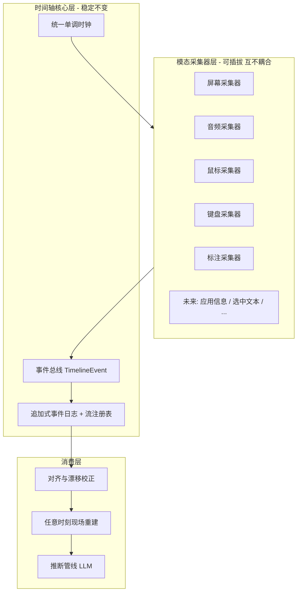
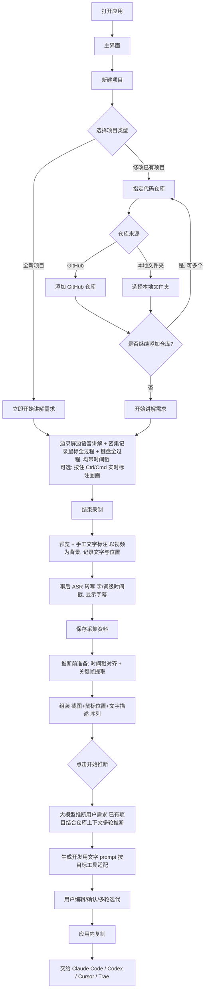

# 多模态需求采集与推断工具 · 产品需求文档（PRD）

> 文档状态：草稿 v0.11（确立"统一时间轴 + 可插拔模态采集器"核心架构理念，贯穿全文档）
> 最后更新：2026-06-12（新增 2.5 核心架构理念；名词表补充 Timeline / Collector / TimelineEvent / StreamRef；5.4 新增可插拔采集器架构需求；第 8 章补充统一数据抽象 8.1；第 9 章采集层架构建议与目录结构调整为"时间轴核心 + 采集器插件"；附录 D 标注为该架构的落地实现）
> 维护者：待定

---

## 1. 文档说明

本文档用于澄清"大模型辅助编程开发工具"的产品需求。当前阶段**只做需求明确与文档准备，不进行任何代码开发**。

文档分为三个层次：

- **已明确需求**：用户已经清晰表达、可直接作为开发依据的内容。
- **建议方案**：基于已明确需求，由本文档提出的设计/技术建议，需用户确认。
- **待确认问题**（见第 11 章）：仍需用户决策的开放性问题。

> 注：本产品将**商业化**，需用户认证与服务端支持（认证方式参考 Cursor），相关设计见 5.8，商业化细节列入第 11 章待确认。

---

## 2. 产品概述

### 2.1 背景

在"大模型辅助编程开发"过程中，最大的痛点之一是**需求难以被准确、完整地表达和传递**。用户（产品负责人 / 开发者）往往很难用纯文字把需求说清楚，而大模型也很难仅凭只言片语推断出真实意图。纯文字描述需求时，普遍存在以下具体问题：

- **界面上下文缺失**：AI 不知道"要改哪里"。
- **修改位置不明确**：无法精准定位到对应代码。
- **逻辑表达抽象**：AI 产出与预期偏差大。
- **代码与界面对应关系难以说明**：界面元素与背后实现难以对齐。

本工具尝试通过**多模态的方式采集需求**：让用户一边操作/演示屏幕，一边用语音和文字讲解，工具同时记录屏幕画面、鼠标位置、语音和文字，并最终由大模型综合这些信息**推断出用户的真实需求**。其本质是**高度还原"面对面讲解需求"的交互方式**。

### 2.2 一句话定义

> 一款桌面端应用：用户边录屏边讲解需求，工具同时密集记录鼠标（位置、左右键、滚轮）与键盘的全部操作并打上时间戳，随后将这些输入与视频按时间戳对齐、分析当时屏幕显示，由大模型推断用户需求，**最终生成一段可直接喂给编程大模型（如 Claude Code、Codex、Cursor、Trae）的开发用文字 prompt**。

### 2.3 产品目标

- **降低需求表达成本**：用户用"说 + 演示"代替"写"，更自然地表达需求。
- **提升需求完整度与准确度**：通过多模态信息互相补充，减少需求遗漏与歧义。
- **结构化输出**：把采集到的零散信息整理为可供大模型/开发使用的结构化需求。

### 2.4 产品价值

- 对用户：表达需求更轻松、更直观。
- 对后续开发（人或 AI）：拿到的需求更清晰、上下文更完整（含目标代码仓库）。

### 2.5 核心架构理念：以时间为轴的可插拔多模态采集（已明确）

本工具的本质，是**以时间为轴，用各种工具收集多模态信息**：屏幕画面、语音、鼠标、键盘、标注……随着应用成熟，未来还会有更多模态（如应用信息——IDE / 浏览器状态、用户选中的文本等）。因此在架构层面确立如下核心理念，作为贯穿全文档的设计基线：

> **统一时间轴（Timeline）是系统的"脊柱"；每一种模态信息由相互独立的"模态采集器（Collector）"产出；所有数据归一为带时间戳的事件或连续流；下游（对齐、现场重建、需求推断）只依赖统一的数据模型，不感知任何具体采集器。**



四条关键抽象：

1. **统一时钟与时间轴**：时间轴核心层提供**唯一授时**（单调时钟，见附录 D），采集器一律不自带时钟；所有模态数据共享同一时间标尺，对齐问题在源头收敛。
2. **采集器统一契约（Collector Contract）**：每个采集器遵循统一生命周期（注册 → 启动 → 暂停 → 恢复 → 停止），并且只产出两类标准化产物——
   - **离散事件**：归一为 `TimelineEvent { t, source, type, payload }`（如鼠标、键盘、标注、语义快照）；
   - **连续流**：音频 / 视频等流式数据，向核心层登记**相对统一时钟的起始偏移**（`StreamRef`），内部用各自 PTS / 采样序号定位。
3. **隔离与降级**：采集器之间**零依赖**；单个采集器失败、无系统权限或被用户关闭时，仅损失该模态的数据，**不影响录制主流程与其他模态**（与 5.7 节扩展"采集失败静默降级"的理念一致）。
4. **开放扩展**：新增一种模态（如 IDE 状态、浏览器 DOM、选中文本）只需实现采集器契约并注册，**时间轴核心层与下游消费层零改动**；数据模型上仅表现为新的 `source` 类型（见第 8 章）。

该理念的产品意义：**采集能力可以随产品成熟不断生长，而系统底座保持稳定**——5.4 节的各项采集能力、5.7 节的语义采集扩展，都是这一架构下的具体采集器实例。

---

## 3. 名词与角色定义


| 名词                      | 说明                                             |
| ----------------------- | ---------------------------------------------- |
| 项目（Project）             | 一次需求采集与推断的工作单元，包含项目类型、关联代码仓库（可选）、若干次录制会话及推断结果。 |
| 全新项目（New Project）       | 从零开始的项目，无既有代码仓库。                               |
| 已有项目（Existing Project）  | 针对已存在代码的修改，需关联一个或多个代码仓库。                       |
| 代码仓库（Repository）        | 关联到"已有项目"的代码来源，可为 GitHub 远程仓库或本地文件夹，**可关联多个**。 |
| 录制会话（Recording Session） | 用户一次连续讲解需求的过程，产生录屏、语音、文字、鼠标轨迹等数据。              |
| 多模态数据                   | 屏幕画面、鼠标位置/轨迹、文字描述、语音描述等共同构成的需求素材。              |
| 统一时间轴（Timeline）        | 整个系统的时间"脊柱"：基于单一单调时钟的统一时间标尺，所有模态数据均以相对它的时间戳记录与对齐（见 2.5、附录 D）。 |
| 模态采集器（Collector）       | 负责采集某一种模态信息的独立组件（如屏幕、音频、鼠标、键盘、标注采集器），遵循统一契约、可插拔、互不耦合（见 2.5）。 |
| 时间轴事件（TimelineEvent）   | 离散模态数据的统一结构：`{ t, source, type, payload }`，所有采集器的离散产物归一为该结构汇入事件日志（见第 8 章）。 |
| 连续流引用（StreamRef）       | 音频/视频等连续流在时间轴上的登记信息（文件引用 + 相对统一时钟的起始偏移），用于与事件对齐（见第 8 章）。 |
| 需求推断                    | 由大模型综合多模态数据，推断并输出用户真实需求的过程。                    |
| 服务端（Server）            | 商业化所需的后端服务，承载用户认证、账户、订阅/计费、用量与授权校验等能力。           |
| 账户（Account）             | 商业化体系下的用户身份，关联登录凭据、订阅套餐与用量。                    |
| 订阅（Subscription）        | 账户所购买的套餐（如 Free / Pro / Team）及其权益与计费状态。           |


| 角色    | 说明                                |
| ----- | --------------------------------- |
| 终端用户  | 有需求要表达的人，通常是产品负责人或开发者；商业化后需注册账户并登录使用。 |
| 运营/管理员 | （服务端侧）管理账户、套餐与用量的内部角色（后台细节待确认）。   |


---

## 4. 用户使用场景（用户故事）

1. **全新项目场景**
  - 作为用户，我打开工具后新建一个"全新项目"，立即开始录屏，一边演示参考界面/草图，一边用语音和文字讲清楚我想要什么，以便工具帮我整理出需求。
2. **已有项目修改场景**
  - 作为用户，我打开工具后新建一个"已有项目"，关联我在 GitHub 上的仓库和本地的一个文件夹，然后开始讲解我希望在现有代码上做哪些修改。
3. **多仓库场景**
  - 作为用户，我的改动涉及前端仓库和后端仓库，我希望能同时关联多个仓库，让工具理解跨仓库的上下文。

---

## 5. 功能需求

### 5.1 应用形态

- **【已明确】** 本工具是一款**电脑桌面端应用程序**（Desktop Application）。
- **【已明确】** 采用 **Electron** 实现跨平台桌面端。
- **【已明确】** 平台支持：**优先支持 macOS，同时支持 Windows**（暂不要求 Linux）。

### 5.2 应用启动与主界面

- **【已明确】** 用户打开程序后，可以**新建一个项目（Project）**。
- **【已明确】** 主界面应包含：
  - 新建项目入口。
  - **历史项目列表**：便于回到既有项目继续工作，并支持项目的**查看 / 重命名 / 删除**等管理功能。
- **【已明确】** 提供**全局设置**（独立于具体项目），至少包含：
  - **大模型配置**（API 提供商、API Key 等，详见 5.5）。
  - **存储路径**配置：**所有数据（项目、录制会话、原始多模态数据、推断结果等）统一存放于用户指定的本地文件夹**（详见下方"数据与隐私基本原则"）。
  - 其他全局偏好（如默认录制范围、快捷键等）。

> **数据与隐私基本原则（已明确）**：
> 1. **数据全部本地化**：所有数据均存放在用户电脑上**指定的文件夹**中，不上传服务端 / 云端。
> 2. **大模型全部用户自配**：所有大模型均由用户**自行提供与配置**（API Key / 端点），工具不代管模型调用与密钥。
> 3. **最小化数据安全风险**：尽量减少需要保护的敏感面——本地数据不外发、密钥仅本地安全存储、服务端只承载账户/计费等必要元数据（见 5.8）。

### 5.3 新建项目流程

- **【已明确】** 新建项目时，用户需要**选择项目类型**：
  - **全新的项目**；或
  - **修改已有的项目**。

#### 5.3.1 全新项目

- **【已明确】** 选择"全新项目"后，用户**可以立刻开始讲解需求**（直接进入录制/讲解环节）。

#### 5.3.2 已有项目（修改）

- **【已明确】** 选择"修改已有项目"后：
  - 用户可以**指定代码仓库**。
  - 代码仓库来源可以是：
    - **GitHub 上的仓库**；或
    - **本地文件夹**。
  - 代码仓库**可以有多个**。
  - 指定完成后，用户可以**开始讲解需求**。
- **【已明确】** 代码仓库关联方式：
  - **GitHub 仓库**：通过**输入仓库 URL** 关联。工具**不实现 OAuth / 凭证管理**，而是**假设用户本地已安装并配置好 git 客户端**，能够通过 `git` 命令正常拉取（clone / pull）与推送（push）代码（含私有仓库的本地凭证）。
  - 关联 GitHub 仓库时，工具会将代码 **clone 到本地**，以便后续分析与作为上下文。
  - **本地文件夹**：通过系统文件选择器选择，**不做校验或限制**（不要求必须是 git 仓库）。
  - **录制开始后仍允许继续增删仓库**。

### 5.4 需求讲解 / 多模态数据采集（核心）

无论全新项目还是已有项目，进入讲解环节后，**用户边录制屏幕视频边用语音讲解自己的需求**。

> **架构基线（见 2.5）**：以下各项采集能力（屏幕、语音、鼠标、键盘、标注等）均是"统一时间轴 + 可插拔模态采集器"架构下的**具体采集器实例**——它们共享同一时钟、遵循同一契约、互不依赖；本节描述的是当前版本需要内置的采集器集合，而非封闭清单。

- **【已明确】** **可插拔采集器架构**：采集层须以"统一时间轴核心 + 可插拔模态采集器"的架构实现（见 2.5）——各模态采集器遵循统一契约、互不耦合，单个采集器失败不影响其他模态与录制主流程；未来可在不改动核心层与下游的前提下，平滑接入新模态（如应用信息——IDE / 浏览器状态、用户选中的文本等）。

工具需要同步采集以下多模态数据：

- **【已明确】** **屏幕视频录制**：录制屏幕画面，作为后续时间轴对齐的基准。
- **【已明确】** **语音讲解**：用户在录屏的同时用语音讲清楚自己的需求。
- **【已明确】** **鼠标全过程记录**：
  - **密集记录鼠标位置**（高频采样的移动轨迹）。
  - **鼠标点按记录**：左键、右键的按下/抬起。
  - **滚轮滚动记录**。
  - 即记录鼠标的**所有操作过程**。
- **【已明确】** **键盘全过程记录**：记录键盘**所有按键**的按下（输入）事件。
- **【已明确】** **统一时间戳**：用户的**所有输入（鼠标、键盘、语音等）都带有对应的时间戳**。
- **【已明确】** **与视频对齐**：这些时间戳将来会**与视频进行对齐**，以还原"某一时刻屏幕显示了什么 + 用户做了什么操作"。
- **【已明确】** **录制范围（录制前由用户自行选择）**，支持三种模式：
  - **单屏幕**：录制某一块屏幕。
  - **多屏幕**：支持**多个屏幕同时录制**。
  - **自定义区域**：用户自由拖拽一个矩形区域，或选择某个应用窗口所占用的矩形范围。
- **【已明确】** **文字描述（基础能力）**：除语音外**需要**支持文字描述补充。
  - 采集方式：**录制结束后补充**，以**视频画面为背景**进行标注。
  - **文字所在的位置（在画面中的坐标）也是重要信息**，需一并记录，用于与屏幕内容/操作对齐。
  - 此为基础能力，与下文的"实时可视化标注"**并存互补**（基础 = 录制后文字标注；增强 = 录制中实时圈画）。
- **【已明确】** **语音转写（ASR）**：采用**事后转写**为文字，并在界面上**显示字幕**。
  - 转写结果需**精确到每个字 / 词级别的时间戳**，用于后续与视频、操作的**语义对齐**。
- **【已明确】** **鼠标采样频率**：约 **20 Hz**。
- **【已明确】** **键盘隐私边界**：**记录密码框等敏感输入，但需要脱敏处理**（不保留明文）。
- **【已明确】** **录制控制方式**：通过 **F2** 快捷键控制——
  - **双击 F2 开始**录制。
  - 录制中**单击 F2 暂停**，再**单击 F2 继续**。
  - **双击 F2 结束**录制。
  - **单次录制时长上限为 10 分钟**；**接近上限时给出提示**（如剩余时间提醒），到达上限后自动结束。
- **【已明确】实时可视化标注（增强能力，纳入范围）**
  - 在录制过程中提供一个**全屏透明的标注覆盖层**：平时鼠标事件完全穿透、不影响用户操作底层程序；用户**按住 Ctrl/Cmd 进入标注模式**，可直接在屏幕上画**矩形 / 圆圈 / 箭头 / 自由画笔 / 文字贴纸**圈出重点，松开后标注保留显示。
  - 价值：相比"仅录制后补充文字"，实时标注能更自然地把"我说的就是这里"与画面位置强绑定，显著提升后续定位精度。
  - **与基础能力的关系**：实时标注（录制中）与录制后文字标注**并存互补**；实时标注列为增强项（优先级 P1，见附录 C），录制后文字标注为基础能力（P0）。
  - 标注事件需带时间戳并入时间轴，供推断阶段"回放"出每一时刻存活的标注（见 8 章 `annotationEvents` / `ComposedScene`）。
- **【建议方案 / 待确认】**
  - 多模态数据的具体存储格式与时间轴对齐的实现细节（工程实现层面，需求层面已明确）。

### 5.5 需求推断（大模型）

- **【已明确】** 推断的输入是：**视频 + 与视频按时间戳对齐的全部用户输入（鼠标全过程、键盘全过程、语音等）**。
- **【已明确】** 推断过程：根据时间戳对齐，**分析每个操作发生时屏幕上的显示内容**，结合用户的所有输入，**最终推断出用户的需求**。
- **【已明确】** **推断时机为录制结束之后**（非实时边录边推），整体流程如下：
  1. **预览与手工标注**：录制结束后，先引导用户**预览**录制内容，并进行**手工文字标注**（以视频为背景，标注内容与位置，见 5.4）。
  2. **保存采集资料**：保存本次采集到的全部多模态数据。
  3. **推断前的准备（关键步骤）**：进行**时间戳对齐**与**视频关键帧提取**；最终提供给大模型的，是一系列**对应时间戳的截图 + 当时鼠标位置 + 该截图对应的文字描述**。
  4. **触发推断**：一切准备就绪后，用户**点击明确的"开始推断"按钮**才进行推断。
- **【已明确】** **大模型由用户自行配置 API**：
  - 支持 **OpenAI** 与 **DeepSeek**（其他提供商暂不支持）。
  - **API Key 由用户自行提供与配置**（在全局设置中，见 5.2）。
- **【已明确】** 用户**可以对推断结果 / 生成的 prompt 进行编辑、确认与多轮迭代修正**。
- **【已明确】** 对**已有项目**，推断需**自动带上所关联代码仓库的上下文**，此处**需要多轮推断**（结合仓库内容逐步细化）。

#### 5.5.1 推断处理管线（建议方案，来自《技术设计文档》）

> 对"已明确"的推断流程做工程级细化，建议将"推断前准备 + 推断"拆解为**三次 LLM 交互 + 一步本地离线计算**，以降低成本并提升定位精度：

1. **第 1 次 · 语音转写（STT）**：将音频转为**带词级时间戳**的转录文本（对应已明确的"事后 ASR + 字幕"）。
2. **第 2 次 · 文本 LLM 识别关键时刻**（纯文本、成本低）：从转录文本中识别"指代词 / 界面元素词 / 操作描述"（如"这里、这个按钮、把这个改成…"），输出**关键时刻时间戳列表**与意图摘要。
3. **本地离线计算（不调用 LLM）**：对每个关键时刻做**时间锚点修正**并**合成"现场图"**——把"该时刻的屏幕截图 + 当时存活的标注 + 鼠标位置聚光圈"离屏合成为一张图。
4. **第 3 次 · 多模态 LLM 输出需求**（带图、成本高）：综合所有关键时刻的"合成图 + 对应语音片段 + 可选代码/DOM 上下文"，输出结构化需求与最终 prompt。

> 收益：仅在少数"关键时刻"传图，多模态调用次数与 token 成本可控；纯文本步骤可用正则兜底降级。

#### 5.5.2 时间锚点定位（核心难点，建议方案）

- **问题**："关键时刻" ≠ "触发词出现的时刻"。词级时间戳精度约 ±200ms，单靠语音不足以精确定位用户"指的是哪里、哪一帧"。
- **方案**：**指代词时间戳 + 鼠标静止点交叉验证**——在指代词前后约 1.5s 窗口内，寻找鼠标连续静止（如 300ms 内位移 < 15px）的区间，取其中点作为最终锚点；找不到静止点则回退到指代词自身时刻。
- **边界**：鼠标未动 / 快速连续指代等场景需降级处理（仅用语音时间戳，交由多模态模型在图中自行定位元素）。
- **意义**：这是把"用户说的"与"屏幕上的位置"精确对齐的关键，直接决定推断质量（详见附录 A）。

### 5.6 结果输出（核心）

- **【已明确】** 最终产物是**一段用于开发的文字描述 prompt**。
- **【已明确】** 该 prompt **可以直接提供给编程大模型 / 编程智能体使用**，目标包括但不限于：**Claude Code、Codex、Cursor、Trae**。
- **【已明确】** prompt 需要**遵循内容规范**，至少涵盖：**目标、上下文、约束、验收标准**等；对**已有项目**还需包含所关联代码仓库的上下文信息。
- **【已明确】** 需要**针对不同目标工具（Claude Code / Codex / Cursor / Trae）做模板适配**。
- **【已明确】** 输出方式：支持**应用内复制**，并支持**导出为文件**。
  - **导出为文件**：导出 **Markdown 需求文档 + 关键时刻合成截图附件**（截图含标注红框/箭头 + 鼠标聚光圈），用相对路径引用，便于 Claude Code 等工具"图文对照"理解。
- **【已明确】输出内容规范**：
  - Markdown 建议结构：上下文（OS / 活跃应用 / 相关文件）→ 需求清单（每条含优先级、位置、描述、验收标准、涉及文件、实现建议、配图）→ 待确认问题。

### 5.7 多轮对话与上下文增强（建议方案，来自《技术设计文档》）

- **【建议方案 / 待确认】两层会话模型**
  - **Session（需求主题，长期存在）**：保存原始录制数据与所有关键时刻合成图。
  - **Round（轮次）**：在同一 Session 下逐轮迭代——Round 1 录制生成 PRD v1；后续可通过"**文字追问**"（如"导航栏高度改成 48px"）或"**补充录制**"产出 v2、v3…（对应已明确的"多轮迭代"）。
  - **跨轮压缩**：以上一轮 PRD 文本作为"压缩记忆"，图片仅在必要时按需重传，控制成本。
  - **历史帧检索**：追问时通过关键词匹配（默认）+ LLM 决策兜底，自动找回相关历史关键帧参与回答。
- **【建议方案 / 待确认】语义采集扩展（可选增强，为"已有项目"提供代码/界面上下文）**
  - **VS Code 扩展**：采集光标/选区/可见代码、当前文件与符号信息，为推断提供**精准代码上下文**（与已明确的"已有项目带仓库上下文"互补，可定位到具体文件行）。
  - **Chrome 扩展**：采集 DOM 快照（元素标签/类名/文本/位置/XPath），为前端界面需求提供结构化上下文。
  - 通信方式：扩展作为客户端通过本地 WebSocket 连接主程序；**采集失败静默降级，不影响主流程**，故为可选项。

### 5.8 用户认证与账户体系（商业化，需服务端支持）

> 本产品将来要**商业化**，因此需要一套**用户认证系统**，并由此引入**服务端（Server）**。认证方式参考 **Cursor**：桌面端发起、浏览器完成登录、深链接回跳、令牌本地安全存储。

- **【已明确】** 应用需要**用户登录后使用**（具体哪些能力对未登录/免费用户开放见第 11 章待确认）。
- **【已明确】** 引入**服务端（Server）**承载账户与商业化能力；桌面端为客户端。
- **【已明确】认证流程（参考 Cursor，OAuth 2.0 授权码 + PKCE）**：
  1. 用户在桌面端点击"登录"，应用**调起系统默认浏览器**打开服务端托管的登录页。
  2. 登录页支持**邮箱密码**与**第三方 OAuth**（如 Google、GitHub）。
  3. 登录成功后，通过**自定义协议深链接**（如 `rake://auth/callback?code=...`）回跳桌面端，回传一次性授权码。
  4. 桌面端用授权码向服务端换取 **access token + refresh token**。
  5. 令牌**本地安全存储**（系统 KeyChain / Credential Store，如 `safeStorage`）；access token 短期有效、refresh token 长期有效并**自动静默刷新**。
  6. **登出**：清除本地令牌并通知服务端吊销会话。
- **【已明确】服务端职责**：
  - **账户管理**：注册、登录、找回密码、第三方账号绑定/解绑、资料管理。
  - **认证与授权**：签发 / 校验 / 刷新令牌（OAuth 2.0 / OIDC），会话与设备管理（多设备登录、远程吊销）。
  - **订阅与计费**：套餐管理（如 Free / Pro / Team）、支付集成、发票（**细节见第 11 章待确认**）。
  - **用量与配额**：按套餐统计与限制用量（如推断次数 / 时长），**细节待确认**。
  - **授权校验（License）**：应用启动与关键操作时校验登录态与套餐权益。
- **【已明确】隐私边界（与现有本地优先策略一致）**：
  - **原始多模态数据（录屏、语音、键鼠、截图等）默认仍只存本地、不上传服务端**；服务端仅保存**账户、订阅/计费、用量等元数据**。
  - 是否提供"云端同步项目 / 团队协作"等需上传数据的能力，**见第 11 章待确认**。
- **【已明确】离线与降级**：
  - 在 access token 有效期内，**本地采集 / 标注 / 合成等可离线进行**（推断本就需要联网）。
  - 令牌过期但可刷新时静默续期；**长时间离线**后要求重新登录（可设宽限期，细节待确认）。
- **【建议方案 / 待确认】与大模型用量的关系**：
  - 当前已明确"用户自带 API Key（OpenAI / DeepSeek）"。商业化后是否额外提供"**平台托管模型 / 代付额度**"作为付费权益，与套餐如何挂钩，**见第 11 章待确认**。

---

## 6. 范围说明（本阶段）

### 6.1 本阶段聚焦

- 明确"需求采集与推断工具"的产品需求。
- 产出本需求文档。

### 6.2 暂不进入

- **不进行任何代码开发**。
- 不进入"基于需求自动改代码/写代码"的后续辅助开发阶段（属于本工具下游，待需求稳定后再单独立项讨论）。

---

## 7. 非功能性需求（初步）


| 类别     | 说明                                                                                                                                                                                                                             |
| ------ | ------------------------------------------------------------------------------------------------------------------------------------------------------------------------------------------------------------------------------ |
| 跨平台    | **优先支持 macOS，同时支持 Windows**；暂不要求 Linux。                                                                                                                                                                                        |
| 性能     | 录屏 + 语音 + 鼠标追踪（约 20 Hz）同时进行时需控制资源占用；单次录制时长上限 10 分钟。**建议**：屏幕截图为主要压力来源，采用"帧差去重（相邻帧差异低于阈值不存储）+ 三级自适应采集（按 CPU/内存动态调整帧率与分辨率）+ 异步写入队列"控制开销。                                                                                         |
| 数据量    | **建议**：10 分钟录制去重后约 ~26MB（音频 ~8MB、屏幕帧 ~18MB、鼠标轨迹 ~120KB、标注/语义 <100KB），可作为存储与处理预算参考。                                                                                                                                             |
| 隐私与安全  | **所有数据均存于用户指定的本地文件夹、不上传云端**；**所有大模型由用户自行提供与配置**（密钥不代管），以尽量减少数据安全暴露面。原始数据**本地存储、不加密**；**键盘记录中的密码框等敏感输入需脱敏**（不保留明文）；不实现代码仓库凭证管理，依赖用户本地 git 客户端。**【已明确】大模型 API Key 采用系统级安全存储加密**（macOS KeyChain / Windows Credential Store，如 Electron `safeStorage`），仅在主进程使用、不暴露给渲染进程/DevTools。 |
| 离线能力   | **采集环节可离线**进行；**推断环节需联网**调用用户配置的第三方大模型 API（OpenAI / DeepSeek）。**建议**：离线时采集/标注/合成图照常完成，STT 与 LLM 步骤排队，网络恢复后自动触发。                                                                                                                |
| 可靠性    | **建议**：录制边采集边持久化（如 SQLite WAL），崩溃后可恢复未完成会话；LLM 调用失败采用重试 + 降级（如纯文本步骤正则兜底）；转录质量过低时给出提示并提供**手动编辑转录文本**入口，修正后可重跑后续推断而无需重录。                                                                                                         |
| 多屏与高分屏 | **建议**：覆盖层/截图严格绑定到选定屏幕；高分屏（Retina，scaleFactor=2）下鼠标逻辑坐标需乘以缩放比才能与截图像素对齐。                                                                                                                                                        |
| 认证与账户安全 | 采用 OAuth 2.0 授权码 + PKCE；令牌**本地系统级安全存储**，不落明文、不暴露给渲染进程/DevTools；与服务端通信全程 **HTTPS/TLS**；支持令牌刷新与会话吊销；密码加盐哈希存储（服务端）。                                                                                                              |
| 服务可用性   | 引入服务端后，登录/鉴权依赖服务端；需考虑可用性（SLA）、限流防刷、滥用防护与审计日志。**建议**：令牌有效期内核心采集能力可离线，降低对服务端实时可用性的硬依赖。                                                                                                                                          |
| 合规与计费   | 涉及账户、支付与可能的个人信息，需满足相应隐私/支付合规（如 GDPR、支付渠道合规）；明确数据处理与用户授权边界。                                                                                                                                                                       |
| 数据留存   | 原始多模态数据**一直保留，除非用户主动删除**（存于用户指定的本地文件夹）；服务端仅保存账户/订阅/用量等必要元数据。                                                                                                                                                                  |


---

## 8. 数据模型（建议草案，待确认）

### 8.1 统一抽象：时间轴事件与连续流（架构基线，见 2.5）

所有模态数据在底层归一为两种形态——**离散事件**与**连续流**，这是采集器可插拔、互不耦合的数据模型基础：

```
TimelineEvent           // 离散事件的统一结构 (所有采集器的离散产物归一于此)
├── t                   // 相对统一时间轴的时间戳 (单调时钟, 见附录 D)
├── source              // 产出该事件的采集器/模态: "mouse" | "keyboard" | "annotation"
│                       //   | "textNote" | "beacon" | "semantic" | ... (开放枚举, 新模态即新 source)
├── type                // 事件类型 (随 source 而定, 如 move / down / up / wheel / add / remove)
└── payload             // 模态特定数据 (坐标、按键、标注图形等)

StreamRef               // 连续流 (音频/视频) 在时间轴上的登记
├── id
├── kind                // "video" | "audio" | ... (新流模态同样开放)
├── fileRef             // 流文件引用
├── startOffset         // 相对统一时钟的起始偏移 (用于与事件对齐)
└── meta                // 分辨率/采样率/所属屏幕等
```

> - 下文 `RecordingSession` 中的 `mouseEvents / keyEvents / annotationEvents / textNotes` 等字段，本质都是**同一条追加式事件日志按 `source` 分类后的视图**；`screenRecordings / audio` 则是 `StreamRef` 的实例。
> - **扩展新模态（如应用信息、选中文本）= 新增一种 `source`（或 `kind`）**，模型骨架、事件日志、对齐与重建逻辑均无需改动。

### 8.2 业务数据模型

```
Project
├── id
├── name
├── type: "new" | "existing"
├── repositories: Repository[]   // 仅 existing 项目有, 录制后仍可增删
├── sessions: RecordingSession[]
└── createdAt / updatedAt

Repository
├── id
├── source: "github" | "local"
├── location           // GitHub URL 或 本地路径
├── localClonePath     // GitHub 仓库 clone 到本地的路径 (source=github 时)
└── // 不存储鉴权信息: 依赖用户本地已配置的 git 客户端

RecordingSession
├── id
├── captureScope       // 录制范围: "single-screen" | "multi-screen" | "region"
│                      //   region: { x, y, width, height } 或 关联的窗口
├── screenRecordings[] // 录屏视频文件引用 (多屏幕时为多路, 时间轴基准, 含起始时间戳)
├── audio              // 语音讲解文件引用
├── transcript[]       // 事后 ASR 转写, 字/词级时间戳: { t, text }  (用于语义对齐, 显示字幕)
├── mouseEvents[]      // 鼠标全过程 (约 20 Hz), 与视频时间轴对齐:
│                      //   move:  { t, x, y }
│                      //   button:{ t, button: left|right, action: down|up, x, y }
│                      //   wheel: { t, deltaX, deltaY, x, y }
├── keyEvents[]        // 键盘全过程: { t, key, action: down|up }  (密码框等敏感输入脱敏)
├── textNotes[]        // 基础能力: 录制后补充的文字标注, 以视频为背景:
│                      //   { t, x, y, text }   (文字内容 + 在画面中的位置)
├── annotationEvents[] // 增强能力: 录制中实时标注事件 (带时间戳, 可回放):
│                      //   add:   { t, id, type: rect|circle|arrow|freehand|text, data }
│                      //   remove:{ t, id }  /  clear: { t }
├── keyframes[]        // 推断前提取的关键帧: { t, screenshotRef, mouse:{x,y}, note }
├── inferredRequirement // 大模型推断结果（中间产物, 支持多轮迭代）
└── generatedPrompt     // 最终输出: 可直接给编程大模型的开发用 prompt (支持按目标工具适配)
```

> 说明：
>
> - 所有 `t` 均为相对**统一时间轴**（8.1 / 附录 D）的时间戳，可与 `screenRecordings` 的时间轴对齐，用于还原每个事件发生时屏幕的显示内容。
> - `keyframes` 是"推断前准备"阶段产出：将关键帧截图 + 对应时刻鼠标位置 + 该截图的文字描述打包后提供给大模型。

**派生数据结构（建议补充，来自《技术设计文档》）**：上述 `keyframes` 可进一步规范为"关键时刻（KeyMoment）+ 合成现场（ComposedScene）"：

```
TranscriptResult        // STT 词级转写结果
├── fullText
├── words[]             // { word, startTime, endTime, confidence }
└── segments[]          // 句子级分段 { text, startTime, endTime }

KeyMoment               // 由文本 LLM 识别 + 鼠标锚点修正得到的语义锚点
├── t                   // 最终锚点 (鼠标静止点修正后)
├── tRaw                // 指代词原始时间戳
├── triggerPhrase       // 触发词原文 (如 "这里这个导航栏")
├── intent              // 意图摘要 (≤15 字)
├── type                // "deictic" | "element" | "action"
├── speechContext       // 前后约 2.5s 转录文本
└── scene: ComposedScene

ComposedScene           // 某一时刻的"合成现场"
├── t
├── screenshot          // 最近一帧截图
├── activeAnnotations[] // 此刻存活的实时标注 (由 annotationEvents 回放得到)
├── mousePosition       // { x, y }
├── semanticContext     // 最近的语义快照 (VS Code / DOM, 可选)
└── compositeImage      // 合成图: 截图 + 标注 + 鼠标聚光圈
```

（可选）`semanticTrack[]`：来自 VS Code / Chrome 扩展的语义快照流，与时间轴对齐，用于丰富"已有项目"的代码/界面上下文。

**服务端数据模型（商业化，建议草案，待确认）**：以下实体存于**服务端**，本地仅缓存登录态与令牌；与上文本地数据（Project/RecordingSession 等）相互独立。

```
Account                 // 用户账户
├── id
├── email
├── passwordHash        // 加盐哈希; 第三方登录可为空
├── oauthIdentities[]   // { provider: google|github, providerUserId }
├── displayName / avatar
├── status              // active | disabled
└── createdAt / updatedAt

Subscription            // 订阅/套餐
├── id
├── accountId
├── plan                // free | pro | team (待确认)
├── status              // active | trialing | past_due | canceled
├── currentPeriodEnd
└── billingRef          // 支付渠道订阅引用 (如 Stripe, 待确认)

UsageRecord             // 用量记录 (按套餐配额统计)
├── id
├── accountId
├── metric              // 如 inference_count | recording_minutes (待确认)
├── amount
└── periodStart / periodEnd

Device / Session        // 设备与登录会话 (多设备登录、远程吊销)
├── id
├── accountId
├── deviceInfo          // 平台、应用版本等
├── refreshTokenId      // 关联可吊销的刷新令牌
├── lastActiveAt
└── createdAt

AuthToken               // 令牌 (access 短期 / refresh 长期)
├── accessToken         // JWT, 短期
├── refreshToken        // 长期, 可吊销
└── expiresAt
```

> 说明：客户端仅在本地安全存储（KeyChain / Credential Store）保存 `accessToken / refreshToken` 及最小化的账户信息缓存；原始多模态数据不上传服务端。

---

## 9. 技术方案建议（待确认，非承诺）

> 以下为已确认方向上的可行性参考，工程细节仍待设计，本阶段不实现。

- **桌面端框架**：**Electron**（已确认），优先适配 macOS，其次 Windows。
- **采集层架构**：按 2.5 的架构基线实现——**统一时间轴核心（单调时钟 + 事件总线 + 追加式事件日志/流注册表）+ 可插拔模态采集器**。每个采集器实现统一契约（生命周期 + 产出 `TimelineEvent` 或登记 `StreamRef`），通过注册表接入；采集器之间零依赖，单个失败自动降级不影响整体；新模态（应用信息、选中文本等）以新增采集器方式接入，核心层与下游零改动。
- **录屏**：操作系统屏幕采集能力（如 Electron `desktopCapturer` + `MediaRecorder`），需支持单屏 / 多屏同时录制 / 自定义矩形区域 / 窗口区域。
- **鼠标轨迹**：通过系统级鼠标位置轮询/事件采集（约 20 Hz），并与录屏时间轴对齐。
- **键盘记录**：全局按键事件采集，密码框等敏感输入需脱敏。
- **语音与字幕**：麦克风采集 + **事后 ASR 转写**，输出字/词级时间戳用于字幕显示与语义对齐。
- **代码仓库**：通过调用本地 `git` 命令 clone / pull GitHub 仓库；本地文件夹直接引用。
- **大模型推断**：由用户配置 **OpenAI / DeepSeek** API（需联网）；推断前进行时间戳对齐与关键帧提取，将"截图 + 鼠标位置 + 文字描述"序列发送给模型；对已有项目结合仓库上下文进行多轮推断。

### 9.1 详细技术选型建议（来自《技术设计文档》，待确认）


| 层级         | 选型建议                                                   | 理由 / 备注                                                      |
| ---------- | ------------------------------------------------------ | ------------------------------------------------------------ |
| 桌面框架       | Electron（+ Vite）                                       | 已确认；原生截屏/全局鼠标权限，生态成熟，双进程模型（Main 管系统能力与 LLM 调用，Renderer 管 UI） |
| 前端框架       | Vue 3                                                  | 适合复杂多面板 UI，生态成熟、上手快                                  |
| 标注引擎       | Fabric.js                                              | 原生支持矩形/圆/画笔/箭头/文字，便于导出 PNG（若采纳实时标注）                          |
| 状态管理 / UI  | Pinia + Tailwind CSS（可选 Element Plus / Naive UI）        | 轻量、风格统一（Vue 生态）                                          |
| 本地持久化      | electron-store（设置）+ better-sqlite3（会话，WAL 模式）          | 边录边写、防崩溃丢数据                                                  |
| API Key 存储 | Electron `safeStorage`（系统 KeyChain / Credential Store） | 见第 7 章安全建议                                                   |
| LLM 接入     | OpenAI SDK + DeepSeek（Provider 可切换）                    | 与已明确的"支持 OpenAI / DeepSeek"一致                                |
| 语音转文字      | Whisper API（默认）/ whisper.cpp 本地（可选）                    | 需词级时间戳；本地模式供隐私敏感场景                                           |
| 视频录制       | `MediaRecorder`（WebM）+ `desktopCapturer`               | 浏览器原生                                                        |
| 关键帧提取      | ffmpeg.wasm                                            | 纯本地处理                                                        |
| 扩展通信（可选）   | WebSocket（本地 27513 端口）                                 | 连接 VS Code / Chrome 扩展                                       |
| 服务端框架（商业化） | Node.js（NestJS / Fastify）或 Go（待定）                      | 承载认证/账户/计费 API；与桌面端技术栈协同（Node 系便于复用 TS 类型）                   |
| 认证方案       | OAuth 2.0 / OIDC（自建，或 Auth0 / Clerk / Keycloak 等，待确认） | 授权码 + PKCE；签发 JWT；支持第三方登录                                    |
| 数据库 / 缓存   | PostgreSQL + Redis                                     | 账户/订阅/用量持久化；Redis 做会话/限流                                     |
| 支付/订阅      | Stripe（或同类，待确认）                                        | 套餐订阅与计费                                                     |
| 部署         | 容器化（Docker）+ 云托管（待确认）                                  | 服务端运维                                                       |


> 注：原《技术设计文档》以 Anthropic（Claude）+ OpenAI 为 LLM 选型，本 PRD 已确认为 **OpenAI / DeepSeek**，以本 PRD 为准。

### 9.2 建议的项目目录结构（待确认，非承诺）

> 基于 Electron 双进程模型 + Vue 3 + Pinia，结合本 PRD 已明确功能（多屏/区域录制、鼠标键盘全过程、录制后/实时标注、事后 ASR、三阶段推断、git 仓库上下文、可选语义扩展）给出的建议工程结构，仅供参考。

```
rake/
├── package.json
├── electron.vite.config.ts          # Electron + Vite 构建配置
├── docs/                            # 需求与设计文档
│
├── src/
│   ├── main/                        # 主进程（系统能力 / LLM 调用 / 持久化）
│   │   ├── index.ts                 # 入口，应用与窗口生命周期
│   │   ├── windows/                 # 窗口管理
│   │   │   ├── mainWindow.ts        # 主窗口
│   │   │   └── overlayWindow.ts     # 透明标注覆盖层窗口（实时标注）
│   │   ├── timeline/                # 时间轴核心层（稳定底座，见 2.5）
│   │   │   ├── clock.ts             # 统一单调时钟（唯一授时）
│   │   │   ├── eventBus.ts          # 事件总线（TimelineEvent 汇入）
│   │   │   ├── eventLog.ts          # 追加式事件日志（单写入者，边录边落盘）
│   │   │   └── streamRegistry.ts    # 连续流注册表（StreamRef：起始偏移登记）
│   │   ├── collectors/              # 模态采集器层（可插拔，互不耦合）
│   │   │   ├── base.ts              # Collector 统一契约（生命周期 + 产出规范）
│   │   │   ├── registry.ts          # 采集器注册表（注册/启动/暂停/恢复/停止/降级）
│   │   │   ├── screen.ts            # 屏幕采集器（单屏/多屏/区域，desktopCapturer）
│   │   │   ├── audio.ts             # 音频采集器（麦克风录制）
│   │   │   ├── mouse.ts             # 鼠标采集器（全过程，约 20Hz）
│   │   │   ├── keyboard.ts          # 键盘采集器（全过程，敏感输入脱敏）
│   │   │   ├── annotation.ts        # 标注采集器（实时标注事件入时间轴）
│   │   │   └── …                    # 未来: 应用信息 / 选中文本等新模态采集器
│   │   ├── recording/
│   │   │   └── controller.ts        # F2 录制控制（始/停/续/止）+ 10 分钟上限
│   │   ├── processing/              # 录制后处理（推断前准备）
│   │   │   ├── keyframe.ts          # 视频关键帧提取（ffmpeg.wasm）
│   │   │   ├── anchor.ts            # 时间锚点定位（鼠标静止点交叉验证）
│   │   │   └── composer.ts          # 合成现场图（截图+标注+鼠标聚光圈）
│   │   ├── llm/                     # 大模型接入
│   │   │   ├── provider.ts          # Provider 抽象（可切换）
│   │   │   ├── openai.ts            # OpenAI
│   │   │   ├── deepseek.ts          # DeepSeek
│   │   │   ├── stt.ts               # 语音转写（Whisper / 本地 whisper.cpp）
│   │   │   └── pipeline.ts          # 三阶段推断管线编排
│   │   ├── repo/
│   │   │   └── git.ts               # 调用本地 git clone/pull，读取仓库上下文
│   │   ├── auth/                    # 用户认证（商业化）
│   │   │   ├── oauth.ts             # 授权码 + PKCE 登录、浏览器调起、深链接回调
│   │   │   ├── tokenStore.ts        # 令牌安全存储与自动刷新（safeStorage）
│   │   │   └── apiClient.ts         # 带鉴权的服务端 API 调用
│   │   ├── storage/
│   │   │   ├── settings.ts          # 全局设置（electron-store）
│   │   │   ├── session.db.ts        # 会话/项目持久化（better-sqlite3, WAL）
│   │   │   └── keystore.ts          # API Key 安全存储（safeStorage）
│   │   ├── semantic/                # 可选语义采集扩展服务端
│   │   │   └── wsServer.ts          # WebSocket Server（localhost:27513）
│   │   └── ipc/                     # IPC handler 注册
│   │
│   ├── preload/                     # 预加载（contextBridge 白名单）
│   │   ├── main.ts
│   │   └── overlay.ts
│   │
│   ├── renderer/                    # 渲染进程（Vue 3 主界面）
│   │   ├── main.ts                  # Vue 应用入口
│   │   ├── App.vue
│   │   ├── router/                  # 路由
│   │   ├── pages/
│   │   │   ├── LoginPage.vue        # 登录 / 账户（商业化）
│   │   │   ├── HomePage.vue         # 主界面 + 历史项目列表
│   │   │   ├── ProjectPage.vue      # 新建/管理项目、关联仓库
│   │   │   ├── RecordPage.vue       # 录制范围选择与录制中状态
│   │   │   ├── ReviewPage.vue       # 录制后预览 + 文字标注 + 字幕
│   │   │   ├── InferPage.vue        # 推断进度、prompt 编辑与多轮迭代
│   │   │   └── SettingsPage.vue     # 全局设置（模型/存储路径等）
│   │   ├── components/
│   │   │   ├── ScreenSelector.vue   # 屏幕/区域选择
│   │   │   ├── AnnotationCanvas.vue # 标注画布（矩形/圆/箭头/画笔/文字）
│   │   │   ├── SubtitleView.vue     # 字幕（字/词级时间戳）
│   │   │   ├── KeyMomentTimeline.vue# 关键时刻时间轴
│   │   │   ├── PromptEditor.vue     # prompt 预览/编辑/复制
│   │   │   └── ProgressPanel.vue    # 处理进度分阶段展示
│   │   ├── stores/                  # Pinia
│   │   │   ├── project.ts
│   │   │   ├── session.ts
│   │   │   └── settings.ts
│   │   └── lib/                     # 渲染侧纯逻辑/工具
│   │
│   ├── overlay/                     # 覆盖层独立渲染入口（轻量标注 UI）
│   │   └── main.ts
│   │
│   └── shared/                      # 主/渲染共享
│       ├── types/                   # Project / RecordingSession / KeyMoment 等类型
│       └── constants.ts
│
├── extensions/                     # 可选语义采集扩展（P1）
│   ├── vscode/                      # 代码上下文采集 + WebSocket 推送
│   └── chrome/                      # DOM 快照采集 + WebSocket 推送
│
└── server/                         # 服务端（商业化：认证/账户/计费）
    ├── package.json
    └── src/
        ├── main.ts                  # 服务入口
        ├── modules/
        │   ├── auth/                # OAuth/OIDC、授权码+PKCE、令牌签发/刷新/吊销
        │   ├── account/            # 注册/登录/找回密码/第三方绑定
        │   ├── subscription/       # 套餐与计费（Stripe 等）
        │   ├── usage/              # 用量统计与配额
        │   └── device/             # 设备/会话管理
        ├── entities/                # Account / Subscription / UsageRecord / Device
        ├── middleware/              # 鉴权、限流、审计
        └── db/                      # PostgreSQL / Redis 访问
```

> 注：`server/` 既可与桌面端同仓库（monorepo）维护，也可独立仓库，具体待确认。

---

## 10. 关键用户流程图




---

## 11. 待确认问题（Open Questions）

> 此前的功能性待确认问题（含 22 项澄清问题与"导出为文件"）均已确认并并入正文，不再罗列。当前仅剩**商业化相关**开放问题：

### 关于商业化与用户认证（见 5.8）
1. **免费 / 付费边界**：未登录或免费用户可使用哪些能力？哪些能力需付费？是否有试用期？
2. **套餐与计费**：套餐如何划分（Free / Pro / Team？）、定价、计费维度（按订阅 / 按用量）？支付渠道（Stripe 或其他）？
3. **用量配额**：是否对推断次数 / 录制时长等设配额？超额如何处理？
4. **认证实现**：自建认证服务，还是采用第三方（Auth0 / Clerk / Keycloak 等）？支持哪些第三方登录（Google / GitHub / …）？
5. **平台托管模型**：是否提供"平台代付的大模型额度"作为付费权益，与"用户自带 API Key"如何共存？
6. **数据上云**：默认遵循"数据全部本地化"原则（不上传原始数据）。是否在未来提供需上传数据的云端同步 / 团队协作？若提供，将作为对该原则的例外，需单独评估数据安全与合规。
7. **团队 / 企业版**：是否需要组织、成员、席位与权限管理？
8. **服务端形态**：`server/` 与桌面端是否同仓库（monorepo）？部署与运维方案？

---

## 12. 风险与依赖（初步）

- **隐私合规风险**：录屏与语音可能包含敏感信息。已通过"**数据全部存于用户指定本地文件夹、不上传云端 + 大模型由用户自配**"将敏感数据暴露面降至最低；残余风险主要在**用户本机安全**（如本地文件被他人访问），需提示用户妥善保管存储文件夹。
- **多模态对齐复杂度**：屏幕、语音、鼠标、文字在时间轴上的对齐与同步存在技术复杂度。**已设计应对方案**：单调时钟唯一标尺 + "场记板"对齐信标 + 分段线性漂移校正 + 事件溯源按需重建（详见附录 D），将该风险显著降低。
- **大模型能力依赖**：需求推断质量高度依赖所选多模态模型的能力与成本。
- **系统权限**：录屏、麦克风、辅助功能（鼠标位置）在不同操作系统上需要不同的系统授权。
- **认证与账户安全**：令牌泄露、会话劫持、撞库等风险；需安全存储、TLS、刷新与吊销、限流防刷。
- **商业化合规**：账户与支付涉及隐私/支付合规（如 GDPR、支付渠道要求）与发票税务等。
- **服务端依赖与成本**：引入服务端带来可用性要求与运维/带宽成本；登录鉴权对服务端形成依赖（需离线宽限策略缓解）。
- **第三方依赖**：认证（如 Auth0/Clerk）与支付（如 Stripe）等第三方的可用性、计费与锁定风险。

---

## 13. 后续步骤建议

1. 确认第 11 章剩余开放问题（输出是否提供"导出为文件"）。
2. 补充交互细节与界面草图。
3. 确认 MVP 范围后，再进入设计与开发阶段（参考附录 C）。
4. 细化工程实现层面的剩余细节：多模态数据的存储格式与时间轴对齐的具体实现（见 5.4）。

---

> 以下附录为从《可视化需求沟通工具·技术设计文档》中提炼、对本 PRD 的补充，均为**建议性质**，需用户确认。

## 附录 A：时间锚点定位要点

整个系统最核心的技术难点是"**如何从语义找到精确的时间点**"，即把用户"说的内容"与"屏幕上的位置/帧"对齐。

- **核心原理**：词级时间戳精度约 ±200ms，单独不够精确。最终锚点 = **指代词时间戳 + 鼠标静止点交叉验证**。
- **示例**：用户说"然后这里…"时鼠标刚移到导航栏（真实指代时刻），紧接着说"这个导航栏"时鼠标已开始离开——最终锚点应取鼠标静止处，而非语义最清晰的词。
- **算法概要**：在指代词前后约 1.5s 窗口内，找连续约 300ms 内位移 < 15px 的鼠标静止区间，取中点为锚点；无静止点则回退指代词时刻。
- **时序重建**：给定锚点 t，找 t 之前最近的屏幕帧、回放标注事件至 t、插值鼠标位置、取最近语义快照，离屏合成为一张"现场图"。
- **精度参考**：交叉验证 ±300ms；仅指代词 ±500ms；纯内容描述则依赖多模态模型视觉搜索。

## 附录 B：三次 LLM 交互对照


|     | 第 1 次          | 第 2 次                   | 第 3 次                         |
| --- | -------------- | ----------------------- | ----------------------------- |
| 模型  | Whisper（STT）   | 文本 LLM（OpenAI/DeepSeek） | 多模态 LLM                       |
| 输入  | 音频             | 词级时间戳文本                 | N 张合成图 + 语音片段（+ 可选代码/DOM 上下文） |
| 输出  | 词级时间戳          | 关键时刻列表                  | 结构化需求 / prompt                |
| 成本  | 按音频秒数          | 低（纯文本）                  | 高（按图计）                        |
| 降级  | 本地 whisper.cpp | 正则兜底                    | 不可替换                          |


## 附录 C：建议的 MVP 优先级

> 本阶段不开发，仅供"确认 MVP 范围"参考。已结合本 PRD 已确认决策调整（如 LLM 为 OpenAI/DeepSeek、时长 10 分钟、鼠标 20Hz）。

**P0（核心主线）**

- Electron 窗口 + 屏幕选择（单屏 / 多屏 / 自定义区域）+ 截图
- 音频录制；鼠标全过程（约 20Hz）+ 键盘全过程（敏感输入脱敏）
- F2 录制控制（双击始/单击停续/双击止）+ 10 分钟上限
- 时序化 Session 数据结构 + 边录边持久化（WAL）
- 录制后预览 + 文字标注（以视频为背景，含位置）
- STT 词级转写 + 字幕；时间戳对齐 + 关键帧提取 + 合成图
- 文本 LLM 关键时刻识别 + 多模态 LLM 推断输出
- prompt 生成 + 应用内复制 + 导出为文件（Markdown + 截图附件）；OpenAI/DeepSeek API Key 管理（安全存储）
- 处理进度分阶段展示

**P1（完整体验）**

- 多轮对话（文字追问 + 历史帧检索）+ prompt 编辑迭代
- 实时标注覆盖层（矩形/圆/箭头/画笔/文字，已纳入，作为录制后标注的增强）
- VS Code / Chrome 语义采集扩展（已有项目代码/界面上下文）
- 转录文本手动编辑入口；崩溃恢复；本地 whisper 可选

**P2（体验优化）**

- 标注样式自定义；项目/会话历史管理与搜索
- 三级自适应采集性能优化；多语言转录

## 附录 D：多模态时间轴对齐方案（巧妙设计，建议方案）

> 针对第 12 章"多模态对齐复杂度"风险给出的核心技术方案。一句话概括：**单调时钟做唯一标尺 + 软件"场记板"信标做交叉校准 + 事件溯源按需重建现场**。
>
> **与 2.5 核心架构理念的关系**：本附录是"统一时间轴核心层"的落地实现——D.2 的"单调时钟（①）+ 追加式事件日志（④）"即 2.5 架构图中时间轴核心层的两大支柱，二者是"理念 ↔ 实现"的关系；任何按采集器契约接入的新模态，自动获得本附录的对齐与重建能力。

### D.1 难点拆解

四路（屏幕帧 / 音频 / 鼠标 / 键盘）+ 标注 + ASR 词级时间戳要对齐到同一时间轴，难在：

1. **多源多时钟**：各采集源来自不同线程/进程/设备，各有时钟。
2. **起录延迟**：`MediaRecorder`、音频、屏幕采集启动时刻并不严格一致，存在数十~数百毫秒偏差。
3. **音频采样漂移**：长录制下音频采样时钟与系统时钟会缓慢漂移（10 分钟可累积可感知误差）。
4. **频率不一致**：视频 ~1fps（变化触发）、鼠标 20Hz、键盘/标注为离散事件、ASR 为词级——非同频，难以简单对齐。

### D.2 核心设计

**① 单调时钟作唯一标尺（Single Monotonic Clock）**

- 主进程取一个**高精度单调时钟**（如 `performance.now()` / `process.hrtime`），记录 `sessionStart`。
- **所有事件**统一打 `t = clock() - sessionStart`（毫秒）。不使用墙钟（wall-clock），规避 NTP 校时跳变与夏令时问题。
- 音频/视频作为连续流，只记录其**相对该时钟的起始偏移**，内部用各自 PTS/采样序号定位。

**② 软件"场记板"对齐信标（Beacon / Clapperboard）**

借鉴电影"打板"：在**录制开始时与每隔约 60s**，同时向多路流注入一个**可被各流独立检测到**的同步标记：

- **视觉**：覆盖层瞬间闪一帧已知颜色/图案（1~2 帧）。
- **音频**：同时播放一个极短蜂鸣（特定频率，便于检测）。
- **事件**：在事件日志写入一条 `beacon { t, seq }`。

后处理时分别在视频里找到"闪屏帧"、在音频里找到"蜂鸣样点"、在事件日志里找到 `beacon.t`，即可**三方互算偏移**，把"视频 PTS / 音频样点 / 事件时钟"映射到同一标尺——彻底消除起录延迟带来的固定偏移。

**③ 分段线性漂移校正（Piecewise-Linear Drift Correction）**

- 相邻两个信标之间，认为时钟漂移近似线性，用两端信标做**线性插值重映射**音频/视频时间。
- 效果：把"长录制累积漂移"切成每 60s 一段的小误差，对齐精度稳定在毫秒级。

**④ 追加式事件日志 + 单写入者（Append-only Event Log, Single Writer）**

- 所有离散事件（鼠标/键盘/标注/信标）由主进程**汇入同一条有序、只追加的日志**（单写入者，天然有序、无需跨流重排）。
- 边录边落盘（SQLite WAL / 追加文件），**崩溃可恢复**：日志即"真相源"，音视频分块写入，末尾损坏可截断修复。

**⑤ 事件溯源按需重建"现场"（Event-Sourced Reconstruction）**

- 不预先存稠密合成图；只存原始流 + 事件日志，**任意时刻 t 现场按需重建**：
  - **二分查找** t 之前最近的屏幕帧（帧数组按 t 有序）。
  - **鼠标插值**：相邻采样点线性插值得到 t 时刻坐标。
  - **标注溯源**：把标注事件（add/remove/clear）回放到 t，得到"此刻存活标注"。
  - 合成截图 + 标注 + 鼠标聚光圈 → `ComposedScene`（见第 8 章）。
- 查找/重建均为 O(log n)，按需触发，存储与算力都省。

### D.3 为什么"巧妙"

- **一把标尺**消灭了多时钟协调问题；**打板信标**用一次"自检"换来全程对齐，无需精确控制各流启动时序；**分段线性**把漂移降维成可忽略的小量；**事件溯源**让"任意时刻的屏幕+操作"可精确回放，且天然支持崩溃恢复与稀疏存储。
- 与既有设计无缝衔接：信标只新增极轻量采集；重建逻辑复用 9 章"时序重建"与 8 章 `ComposedScene`。

### D.4 降级策略

- **无法检测到信标**（如闪屏被遮挡）：回退到"以各流起始偏移对齐"，精度下降但可用。
- **关键时刻定位**：在此对齐基础上再叠加附录 A 的"鼠标静止点交叉验证"，把语义锚点进一步精确化。

> 落地优先级建议：D.2 的 ①④⑤ 属对齐与重建地基，列入 **P0**；②③（信标与漂移校正）作为精度增强，可列入 **P1**。

