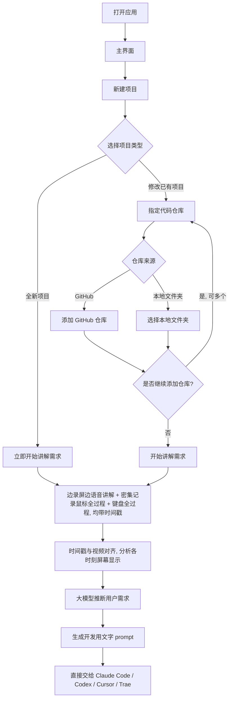

# 多模态需求采集与推断工具 · 产品需求文档（PRD）

> 文档状态：草稿 v0.2（仅需求澄清阶段，暂不进入开发）
> 最后更新：2026-06-09（补充：鼠标/键盘全过程记录与时间戳对齐、最终输出为可直接喂给编程大模型的开发 prompt）
> 维护者：待定

---

## 1. 文档说明

本文档用于澄清"大模型辅助编程开发工具"的产品需求。当前阶段**只做需求明确与文档准备，不进行任何代码开发**。

文档分为三个层次：

- **已明确需求**：用户已经清晰表达、可直接作为开发依据的内容。
- **建议方案**：基于已明确需求，由本文档提出的设计/技术建议，需用户确认。
- **待确认问题**（见第 11 章）：仍需用户决策的开放性问题。

---

## 2. 产品概述

### 2.1 背景

在"大模型辅助编程开发"过程中，最大的痛点之一是**需求难以被准确、完整地表达和传递**。用户（产品负责人 / 开发者）往往很难用纯文字把需求说清楚，而大模型也很难仅凭只言片语推断出真实意图。

本工具尝试通过**多模态的方式采集需求**：让用户一边操作/演示屏幕，一边用语音和文字讲解，工具同时记录屏幕画面、鼠标位置、语音和文字，并最终由大模型综合这些信息**推断出用户的真实需求**。

### 2.2 一句话定义

> 一款桌面端应用：用户边录屏边讲解需求，工具同时密集记录鼠标（位置、左右键、滚轮）与键盘的全部操作并打上时间戳，随后将这些输入与视频按时间戳对齐、分析当时屏幕显示，由大模型推断用户需求，**最终生成一段可直接喂给编程大模型（如 Claude Code、Codex、Cursor、Trae）的开发用文字 prompt**。

### 2.3 产品目标

- **降低需求表达成本**：用户用"说 + 演示"代替"写"，更自然地表达需求。
- **提升需求完整度与准确度**：通过多模态信息互相补充，减少需求遗漏与歧义。
- **结构化输出**：把采集到的零散信息整理为可供大模型/开发使用的结构化需求。

### 2.4 产品价值

- 对用户：表达需求更轻松、更直观。
- 对后续开发（人或 AI）：拿到的需求更清晰、上下文更完整（含目标代码仓库）。

---

## 3. 名词与角色定义

| 名词 | 说明 |
| --- | --- |
| 项目（Project） | 一次需求采集与推断的工作单元，包含项目类型、关联代码仓库（可选）、若干次录制会话及推断结果。 |
| 全新项目（New Project） | 从零开始的项目，无既有代码仓库。 |
| 已有项目（Existing Project） | 针对已存在代码的修改，需关联一个或多个代码仓库。 |
| 代码仓库（Repository） | 关联到"已有项目"的代码来源，可为 GitHub 远程仓库或本地文件夹，**可关联多个**。 |
| 录制会话（Recording Session） | 用户一次连续讲解需求的过程，产生录屏、语音、文字、鼠标轨迹等数据。 |
| 多模态数据 | 屏幕画面、鼠标位置/轨迹、文字描述、语音描述等共同构成的需求素材。 |
| 需求推断 | 由大模型综合多模态数据，推断并输出用户真实需求的过程。 |

| 角色 | 说明 |
| --- | --- |
| 终端用户 | 有需求要表达的人，通常是产品负责人或开发者。 |

---

## 4. 用户使用场景（用户故事）

1. **全新项目场景**
   - 作为用户，我打开工具后新建一个"全新项目"，立即开始录屏，一边演示参考界面/草图，一边用语音和文字讲清楚我想要什么，以便工具帮我整理出需求。
2. **已有项目修改场景**
   - 作为用户，我打开工具后新建一个"已有项目"，关联我在 GitHub 上的仓库和本地的一个文件夹，然后开始讲解我希望在现有代码上做哪些修改。
3. **多仓库场景**
   - 作为用户，我的改动涉及前端仓库和后端仓库，我希望能同时关联多个仓库，让工具理解跨仓库的上下文。

---

## 5. 功能需求

### 5.1 应用形态

- **【已明确】** 本工具是一款**电脑桌面端应用程序**（Desktop Application）。
- **【建议方案】** 跨平台桌面端实现（如 Electron / Tauri 等），具体技术选型见第 9 章，待确认。

### 5.2 应用启动与主界面

- **【已明确】** 用户打开程序后，可以**新建一个项目（Project）**。
- **【建议方案】** 主界面应包含：
  - 新建项目入口。
  - 历史项目列表（便于回到既有项目继续工作）。
  - 待确认：是否需要历史项目列表、是否需要项目搜索/删除等管理功能（见第 11 章）。

### 5.3 新建项目流程

- **【已明确】** 新建项目时，用户需要**选择项目类型**：
  - **全新的项目**；或
  - **修改已有的项目**。

#### 5.3.1 全新项目

- **【已明确】** 选择"全新项目"后，用户**可以立刻开始讲解需求**（直接进入录制/讲解环节）。

#### 5.3.2 已有项目（修改）

- **【已明确】** 选择"修改已有项目"后：
  - 用户可以**指定代码仓库**。
  - 代码仓库来源可以是：
    - **GitHub 上的仓库**；或
    - **本地文件夹**。
  - 代码仓库**可以有多个**。
  - 指定完成后，用户可以**开始讲解需求**。
- **【建议方案 / 待确认】**
  - GitHub 仓库的关联方式（输入 URL / OAuth 授权 / 是否需要 clone 到本地 / 私有仓库鉴权方式）。
  - 本地文件夹通过系统文件选择器选择。
  - 是否允许在录制开始后继续增删仓库。
  - 见第 11 章。

### 5.4 需求讲解 / 多模态数据采集（核心）

无论全新项目还是已有项目，进入讲解环节后，**用户边录制屏幕视频边用语音讲解自己的需求**。工具需要同步采集以下多模态数据：

- **【已明确】** **屏幕视频录制**：录制屏幕画面，作为后续时间轴对齐的基准。
- **【已明确】** **语音讲解**：用户在录屏的同时用语音讲清楚自己的需求。
- **【已明确】** **鼠标全过程记录**：
  - **密集记录鼠标位置**（高频采样的移动轨迹）。
  - **鼠标点按记录**：左键、右键的按下/抬起。
  - **滚轮滚动记录**。
  - 即记录鼠标的**所有操作过程**。
- **【已明确】** **键盘全过程记录**：记录键盘**所有按键**的按下（输入）事件。
- **【已明确】** **统一时间戳**：用户的**所有输入（鼠标、键盘、语音等）都带有对应的时间戳**。
- **【已明确】** **与视频对齐**：这些时间戳将来会**与视频进行对齐**，以还原"某一时刻屏幕显示了什么 + 用户做了什么操作"。

- **【建议方案 / 待确认】**
  - 文字描述（除语音外的补充文字说明）是否需要，以及在录制中实时输入还是录制前后补充。
  - 语音是否需要实时/事后转写为文字（ASR），以及是否在界面显示字幕。
  - 录制的开始/暂停/继续/结束控制方式与时长限制。
  - 录制范围：全屏 / 指定窗口 / 指定区域。
  - 鼠标位置的采样频率（"密集"的具体目标，如多少 Hz）。
  - 键盘记录的范围与隐私边界（是否记录密码框等敏感输入）。
  - 多模态数据的具体存储格式与时间轴对齐实现。
  - 见第 11 章。

### 5.5 需求推断（大模型）

- **【已明确】** 推断的输入是：**视频 + 与视频按时间戳对齐的全部用户输入（鼠标全过程、键盘全过程、语音等）**。
- **【已明确】** 推断过程：根据时间戳对齐，**分析每个操作发生时屏幕上的显示内容**，结合用户的所有输入，**最终推断出用户的需求**。
- **【建议方案 / 待确认】**
  - 使用的大模型与多模态能力（视觉理解屏幕画面 + 语音理解 + 事件序列理解）。
  - 是否需要联网调用第三方模型 API，或支持本地模型。
  - 推断是实时进行还是录制结束后批量进行。
  - 用户能否对推断/生成的 prompt 进行编辑、确认、迭代修正。
  - 见第 11 章。

### 5.6 结果输出（核心）

- **【已明确】** 最终产物是**一段用于开发的文字描述 prompt**。
- **【已明确】** 该 prompt **可以直接提供给编程大模型 / 编程智能体使用**，目标包括但不限于：**Claude Code、Codex、Cursor、Trae**。
- **【建议方案 / 待确认】**
  - prompt 的结构与内容规范（是否包含目标、上下文、约束、涉及的代码仓库信息、验收标准等）。
  - 针对不同目标工具（Claude Code / Codex / Cursor / Trae）是否需要不同的 prompt 模板或适配。
  - 输出的查看、复制、导出方式（应用内复制 / 导出文件等）。
  - 对"已有项目"，prompt 中是否需要带上所关联代码仓库的上下文信息。
  - 见第 11 章。

---

## 6. 范围说明（本阶段）

### 6.1 本阶段聚焦

- 明确"需求采集与推断工具"的产品需求。
- 产出本需求文档。

### 6.2 暂不进入

- **不进行任何代码开发**。
- 不进入"基于需求自动改代码/写代码"的后续辅助开发阶段（属于本工具下游，待需求稳定后再单独立项讨论）。

---

## 7. 非功能性需求（初步）

| 类别 | 说明（待确认） |
| --- | --- |
| 跨平台 | 是否需要同时支持 Windows / macOS / Linux？ |
| 性能 | 录屏 + 语音 + 鼠标追踪同时进行时的资源占用要求。 |
| 隐私与安全 | 录屏/语音含敏感信息，数据存储在本地还是云端？是否需加密？代码仓库凭证如何安全存储？ |
| 离线能力 | 是否要求在无网络环境下也能采集（推断可后置）？ |
| 数据留存 | 原始多模态数据是否长期保存、是否可删除。 |

---

## 8. 数据模型（建议草案，待确认）

```
Project
├── id
├── name
├── type: "new" | "existing"
├── repositories: Repository[]   // 仅 existing 项目有
├── sessions: RecordingSession[]
└── createdAt / updatedAt

Repository
├── id
├── source: "github" | "local"
├── location           // GitHub URL 或 本地路径
└── (鉴权信息，待确认)

RecordingSession
├── id
├── screenRecording    // 录屏视频文件引用（时间轴基准, 含起始时间戳）
├── audio              // 语音讲解文件引用 / 可选转写文本
├── mouseEvents[]      // 鼠标全过程, 与视频时间轴对齐:
│                      //   move:  { t, x, y }            (密集采样)
│                      //   button:{ t, button: left|right, action: down|up, x, y }
│                      //   wheel: { t, deltaX, deltaY, x, y }
├── keyEvents[]        // 键盘全过程: { t, key, action: down|up }
├── textNotes          // 可选: 补充文字描述
├── inferredRequirement // 大模型推断结果（中间产物）
└── generatedPrompt     // 最终输出: 可直接给编程大模型的开发用 prompt
```

> 说明：所有 `t` 均为相对/绝对时间戳，可与 `screenRecording` 的时间轴对齐，用于还原每个事件发生时屏幕的显示内容。

---

## 9. 技术方案建议（待确认，非承诺）

> 以下仅为可行性参考，最终选型需在确认需求后决定，本阶段不实现。

- **桌面端框架**：Electron（生态成熟、跨平台、录屏与系统能力支持好）或 Tauri（更轻量）。
- **录屏**：操作系统屏幕采集能力（如 Electron `desktopCapturer` + `MediaRecorder`）。
- **鼠标轨迹**：通过系统级鼠标位置轮询/事件采集，并与录屏时间轴对齐。
- **语音**：麦克风采集 + 可选的语音转文本（ASR）。
- **大模型推断**：多模态模型（需视觉 + 语音 + 文本理解能力）。

---

## 10. 关键用户流程图



---

## 11. 待确认问题（Open Questions）

以下问题需要用户确认后，才能进入设计与开发阶段：

### 关于平台与形态
1. 桌面端需要支持哪些操作系统（Windows / macOS / Linux）？是否有优先级？
2. 技术选型是否有偏好（Electron / Tauri / 原生）？

### 关于主界面与项目管理
3. 是否需要"历史项目列表"以及项目的查看/重命名/删除等管理功能？
4. 是否需要项目之外的全局设置（如模型配置、账户、存储路径）？

### 关于已有项目与代码仓库
5. GitHub 仓库的关联方式：直接输入 URL，还是需要 OAuth 登录授权？是否需要支持私有仓库？凭证如何提供与保存？
6. 关联 GitHub 仓库时，是否需要把代码 clone 到本地以便分析？
7. 本地文件夹是否通过系统文件选择器选择？是否需要校验/限制（如必须是 git 仓库）？
8. 录制开始后是否还允许增删仓库？

### 关于多模态采集
> 已明确（2026-06-09）：边录屏边语音讲解；密集记录鼠标位置 + 左右键 + 滚轮（鼠标全过程）；记录键盘全部按键；所有输入带时间戳并与视频对齐。以下为剩余细节：
9. 录制范围：全屏、指定窗口，还是指定区域？
10. 除语音外，是否还需要"文字描述"输入？若需要，是录制中实时输入还是录制前/后补充？
11. 语音是否需要转写为文字（实时/事后 ASR）？是否需要在界面上显示字幕？
12. 鼠标位置的采样频率（"密集"的具体目标，如 30/60/120 Hz）？
13. 键盘记录的隐私边界：是否记录密码框等敏感输入？是否需要脱敏？
14. 录制的控制方式（开始/暂停/继续/结束）与时长限制？

### 关于需求推断与输出
> 已明确（2026-06-09）：输出是一段可直接给 Claude Code / Codex / Cursor / Trae 等编程大模型的开发用文字 prompt；推断依据为视频与对齐后的全部输入及当时屏幕显示。以下为剩余细节：
15. 推断是录制结束后进行，还是边录边推断？
16. 是否使用第三方大模型 API（需联网）？由谁提供 API Key？是否需要支持本地模型？多模态模型如何选型？
17. 用户是否需要对生成的 prompt 进行编辑、确认与多轮迭代？
18. prompt 的内容规范（目标/上下文/约束/验收标准等）以及是否针对不同目标工具做模板适配？
19. 对"已有项目"，prompt 中是否需要自动带上所关联代码仓库的上下文？
20. 最终 prompt 的导出/复制方式（应用内复制、导出文件等）？

### 关于隐私与数据
21. 录屏、语音、键鼠记录等原始数据存储在本地还是云端？是否需要加密？
22. 数据保留与删除策略？

---

## 12. 风险与依赖（初步）

- **隐私合规风险**：录屏与语音可能包含敏感信息，需明确数据边界与用户授权。
- **多模态对齐复杂度**：屏幕、语音、鼠标、文字在时间轴上的对齐与同步存在技术复杂度。
- **大模型能力依赖**：需求推断质量高度依赖所选多模态模型的能力与成本。
- **系统权限**：录屏、麦克风、辅助功能（鼠标位置）在不同操作系统上需要不同的系统授权。

---

## 13. 后续步骤建议

1. 用户对第 11 章"待确认问题"逐项给出答复或优先级。
2. 基于答复，将"建议方案"升级为"已明确需求"，并补充交互细节与界面草图。
3. 确认 MVP 范围后，再进入设计与开发阶段。
